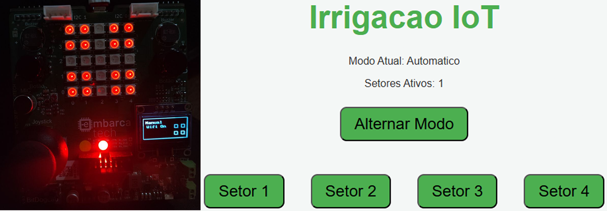

# Sistema de Irrigação Automático



## Descrição

O **Sistema de Irrigação Automático** é um projeto desenvolvido com a placa **BitDogLab** (microcontrolador **RP2040**) para gerenciar quatro setores de irrigação de forma inteligente. O sistema oferece dois modos de operação: **Manual** e **Automático**, controlados via interface web, joystick, ou botões físicos. Feedback visual (matriz de LEDs, display OLED, LEDs RGB) e sonoro (buzzer) tornam o sistema intuitivo e eficiente.

## Funcionalidades

### Modo Manual
- Controle individual dos setores (1 a 4) via:
  - **Interface Web**: Botões para ligar/desligar setores (ex.: "Setor 1").
  - **Joystick**: Eixos X (GP26) e Y (GP27) mapeados em uma grade 2x2:
    - Setor 1: X (3000–4095), Y (0–1000)
    - Setor 2: X (3000–4095), Y (3000–4095)
    - Setor 3: X (0–1000), Y (0–1000)
    - Setor 4: X (0–1000), Y (3000–4095)
- **Feedback**:
  - Buzzer: Som de 100 Hz por 100 ms ao ligar/desligar setores.
  - LED RGB: Vermelho (GP13) indica modo manual.

### Modo Automático
- Alterna automaticamente entre setores (1 → 2 → 3 → 4 → 1) a cada 10 segundos.
- Apenas um setor ativo por vez.
- **Feedback**:
  - Buzzer: Som de 500 Hz por 50 ms a cada troca.
  - LED RGB: Verde (GP11) indica modo automático.
- Intervalo fixo de 10 segundos (ajustável no código).

### Alternância entre Modos
- Via:
  - Botão "Alternar Modo" na interface web.
  - Botão A (GP5) na placa.
- **Feedback**:
  - Buzzer: Som de 500 Hz por 50 ms.
  - LED RGB: Alterna entre verde (automático) e vermelho (manual).
  - Display OLED: Atualiza para "Manual" ou "Automático".

### Exibição Visual
- **Matriz de LEDs** (5x5, WS2812, GP7):
  - Verde: Setor ligado.
  - Vermelho: Setor desligado.
- **Display OLED** (SSD1306, 128x64, I2C em GP14-SDA, GP15-SCL):
  - Modo atual ("Manual" ou "Automático").
  - Status do Wi-Fi ("On" ou "Off").
  - Quatro retângulos animados (preenchidos para ligado, vazios para desligado).
- **LED RGB**:
  - Verde (GP11): Modo automático.
  - Vermelho (GP13): Modo manual.

### Feedback Sonoro
- **Buzzer** (GP10):
  - 100 Hz, 100 ms: Ligar/desligar setores.
  - 500 Hz, 50 ms: Troca de modo ou setor (automático).
- Gerenciado por interrupções no modo automático.

### Modo Boot
- Botão B (GP6): Reinicia no modo BOOTSEL para upload de firmware.

## Tecnologias Utilizadas

- **Placa**: BitDogLab (RP2040)
- **Periféricos**:
  - Matriz de LEDs WS2812 (5x5, GP7)
  - Display OLED SSD1306 (I2C, GP14-SDA, GP15-SCL)
  - Joystick (ADC, GP26-X, GP27-Y)
  - LED RGB (GP11-verde, GP13-vermelho)
  - Buzzer (PWM, GP10)
  - Botões (GP5-A, GP6-B)
- **Conectividade**: Wi-Fi CYW43 (SSID: "Tesla", senha: "123456788")
- **Software**: C, Pico SDK, lwIP (servidor HTTP)
- **Bibliotecas**: `ssd1306.h`, `font.h`, `numeros.h`

## Pré-requisitos

- [Pico SDK](https://github.com/raspberrypi/pico-sdk)
- Placa BitDogLab com RP2040
- Componentes: Matriz de LEDs, display OLED, joystick, buzzer, LEDs RGB, botões
- Ferramentas: Compilador C (ex.: GCC), CMake, terminal serial (ex.: minicom)

## Como Rodar o Projeto

1. **Clone o Repositório**:
   ```bash
   git clone https://github.com/Danngas/Sistema-de-Irrigacao-com-Controle-via-Web-BitDogLab
   cd Sistema-de-Irrigacao-com-Controle-via-Web-BitDogLab
   ```

2. **Conecte os Componentes**:
   - Matriz de LEDs: GP7
   - Display OLED: GP14 (SDA), GP15 (SCL)
   - Joystick: GP26 (X), GP27 (Y), 3.3V, GND
   - Buzzer: GP10
   - Botões: GP5 (A), GP6 (B)
   - LEDs RGB: GP11 (verde), GP13 (vermelho)

3. **Configure o Ambiente**:
   - Instale o Pico SDK e configure o ambiente (ex.: VS Code com CMake).
   - Certifique-se de que as bibliotecas (`ssd1306.h`, `font.h`, `numeros.h`) estão no diretório `lib`.

4. **Compile e Faça Upload**:
   ```bash
   mkdir build && cd build
   cmake ..
   make
   ```
   - Pressione o Botão B (GP6) para entrar no modo BOOTSEL.
   - Copie o arquivo `.uf2` gerado para a placa via USB.

5. **Acesse a Interface Web**:
   - Conecte a placa à rede Wi-Fi (SSID: "Tesla", senha: "123456788").
   - Use um terminal serial (ex.: `minicom -b 115200 -o -D /dev/ttyACM0`) para obter o IP da placa.
   - Acesse o IP no navegador (ex.: `http://192.168.x.x`).
   - Controle os setores e alterne os modos via interface web.

6. **Operação**:
   - **Manual**: Use o joystick ou interface web para ligar/desligar setores.
   - **Automático**: Ative via Botão A ou web para alternância automática.
   - Monitore via matriz de LEDs, display OLED, LED RGB, e buzzer.

## Estrutura do Repositório

```
├── led_control_webserver.c  # Código principal
├── numeros.h                # Controle da matriz de LEDs
├── matrizled.c              # Implementação da matriz de LEDs
├── ws2818b.pio              # Programa PIO para LEDs WS2812
├── lib/
│   ├── ssd1306.h            # Biblioteca do display OLED
│   ├── font.h               # Fontes para o display
├── CMakeLists.txt           # Configuração do build
└── README.md                # Documentação
```

## Licença

Este projeto é licenciado sob a [MIT License](LICENSE). Sinta-se à vontade para usar, modificar e compartilhar. Créditos ao autor: **Daniel Silva de Souza**.

## Links

- **GitHub**: [Sistema de Irrigação com Controle via Web](https://github.com/Danngas/Sistema-de-Irrigacao-com-Controle-via-Web-BitDogLab)
- **Vídeo de Demonstração**: [YouTube](https://youtu.be/2POJI94imow)

## Contato

Para dúvidas ou sugestões, entre em contato com **Daniel Silva de Souza** via [GitHub](https://github.com/Danngas).
